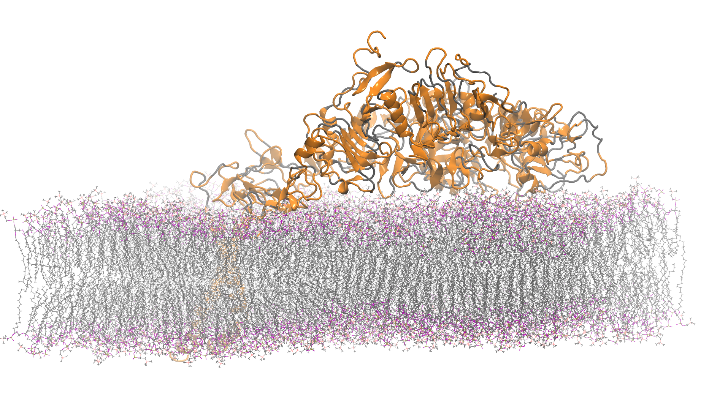

# Energy Aware Runtime (EAR) Tutorial

>EAR documentation for use on Snellius here: https://servicedesk.surf.nl/wiki/pages/viewpage.action?pageId=62226671
>
>EAR full documentation can be found here https://gitlab.bsc.es/ear_team/ear/-/wikis/home

## Section Outline

1. [Introduction](#introduction)
2. [EARL (the library)](#EARL)
3. [Tools](#tools)
4. [Excersizes](#excersizes)


<h2 id="introduction">Introduction</h2>

The Energy Aware Runtime (EAR) package provides an energy management framework for super computers. This tutorial covers the "end-user" experience with EAR.

EAR usage on Snellius can be decomposed into two "services." 

1. The EAR library (EARL): EARL is loaded (at runtime) when launching an application through the EAR Loader (EARLO) and SLURM plugin (EARPLUG). The EARL provides functionality to monitor energy (and performance) metrics of an application and additionally the ability to select the optimal CPU frequency according to the application and the node characteristics. 

2. Tools: Which include Job accounting (via the command eacct) which queries energy information of a paprticulair job or list of jobs from the the EAR database (EAR DB) on Snellius.


<h2 id="EARL">EARL (the library)</h2>


### EARD: Node Manager
The node daemon is the component in charge of providing any kind of services that requires privileged capabilities. Current version is conceived as an external process executed with root privileges.
The EARD provides the following services, each one covered by one thread:

Provides privileged metrics to EARL such as the average frequency, uncore integrated memory controller counters to compute the memory bandwidth, as well as energy metrics (DC node, DRAM and package energy).
Implements a periodic power monitoring service. This service allows EAR package to control the total energy consumed in the system.
Offers a remote API used by EARplug, EARGM and EAR commands. This API accepts requests such as get the system status, change policy settings or notify new job/end job events.


### Example usage in a batch script

```
#SBATCH --ear=on
#SBATCH --ear-policy=monitoring
```

FULL example:
```bash
#!/bin/bash

#SBATCH -p thin
#SBATCH -n 128
#SBATCH -t 00:20:00
#SBATCH --exclusive 
#SBATCH --output=GROMACS_run.out
#SBATCH --error=GROMACS_run.err

#SBATCH --ear=on
#SBATCH --ear-policy=monitoring

module load 2022
module load foss/2022a
module load GROMACS/2021.6-foss-2022a

srun --ntasks=128 --cpus-per-task=1 gmx_mpi mdrun -s benchmark.tpr 
```


<h2 id="tools">Tools</h2>

```
module load 2022
module load ear
```


```
squeue
             JOBID PARTITION     NAME     USER ST       TIME  NODES NODELIST(REASON)
           2884239      thin ear_sbat benjamic  R       2:19      1 tcn352
```

```
eacct -j JOB_ID
```
Example:
```
[benjamic@int4 EAR]$ eacct -j 2884239
    JOB-STEP USER       APPLICATION      POLICY NODES AVG/DEF/IMC(GHz) TIME(s)    POWER(W) GBS     CPI   ENERGY(J)    GFLOPS/W IO(MBs) MPI%  G-POW (T/U)   G-FREQ  G-UTIL(G/MEM)
2884239-sb   benjamic   ear_sbatch_GROMA MO     1     2.57/2.60/---    386.00     596.51   ---     ---   230253       ---      ---     ---   ---           ---     ---          
2884239-0    benjamic   ear_sbatch_GROMA MO     1     2.57/2.60/1.47   348.64     617.18   8.33    0.33  215175       0.2930   0.3     77.6  0.00/---      ---     --- 
```

helpfull comands
```
eacct -j 2884239 -l | less -S
```


<h2 id="excersizes">Excersizes</h2>


> Image Source: 
https://www.hecbiosim.ac.uk/access-hpc/benchmarks


Download the GROMACS benchmark run, which simulated a 465K atom system.
```
curl -LJ https://github.com/victorusu/GROMACS_Benchmark_Suite/raw/1.0.0/HECBioSim/hEGFRDimer/benchmark.tpr -o hEGFRDimer_benchmark.tpr
```


1. What is the best policy to save energy for the GROMACS Run?
  - How much energy do you save? 
  - What is the performance degedation for using such a policy?
  - How does the size of the domain (simulation) change things?
    - **20K atom system** 
    ```
    curl -LJ https://github.com/victorusu/GROMACS_Benchmark_Suite/raw/1.0.0/HECBioSim/Crambin/benchmark.tpr -o Crambin_benchmark.tpr
    ```
    - **1.4M atom system** 
    ``` 
    curl -LJ https://github.com/victorusu/GROMACS_Benchmark_Suite/raw/1.0.0/HECBioSim/hEGFRDimerPair/benchmark.tpr -o hEGFRDimerPair_benchmark.tpr
    ``` 
    - **3M atom system** 
    ```
    curl -LJ https://github.com/victorusu/GROMACS_Benchmark_Suite/raw/1.0.0/HECBioSim/hEGFRDimerSmallerPL/benchmark.tpr -o hEGFRDimerSmallerPL_benchmark.tpr
    ```

