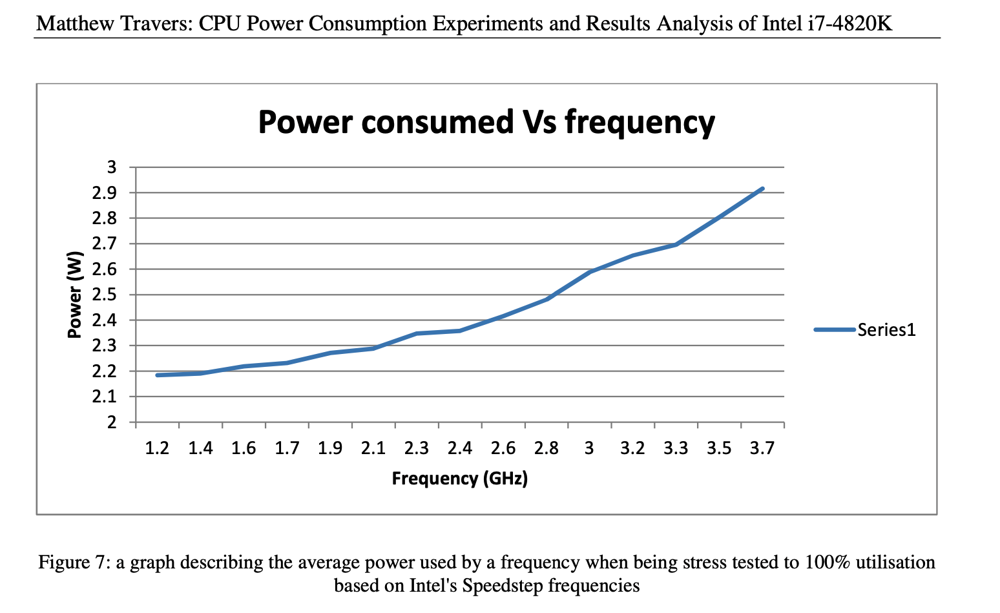
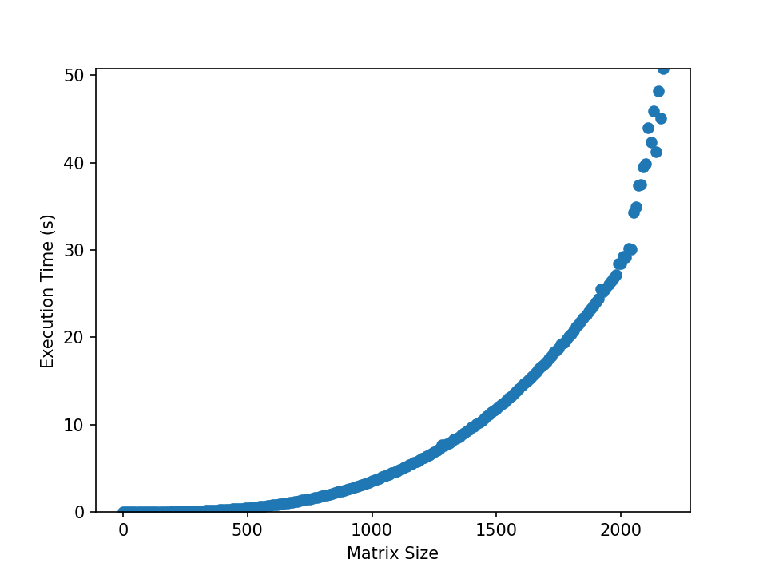
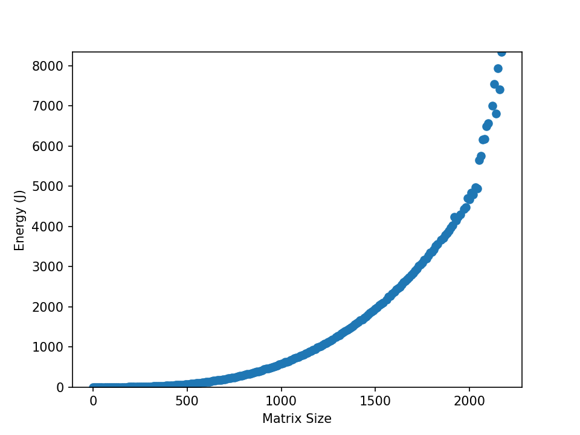
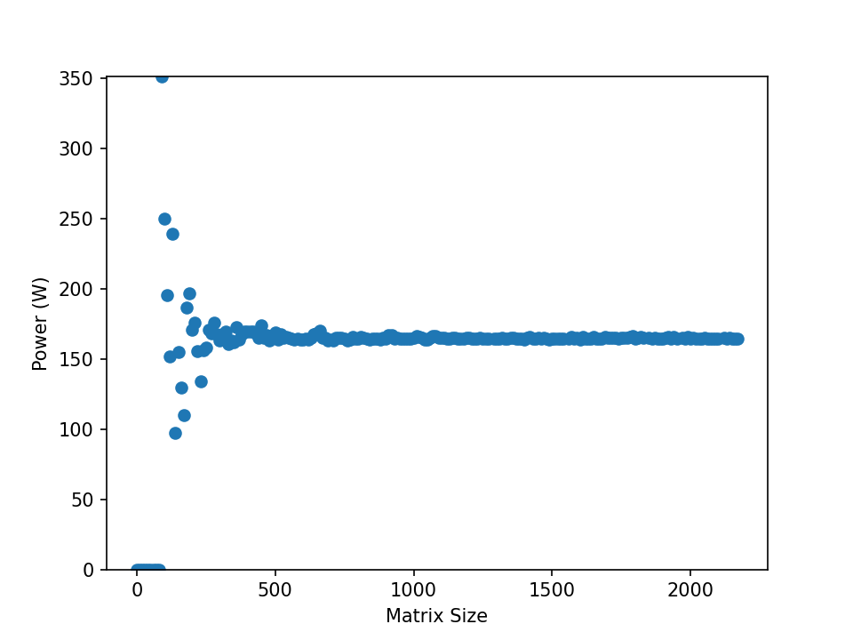

# Energy and power monitoring hands on session:
## Section Outline

1. [Basic Concepts](#concepts)
2. [Linux tools](#linux)
3. [Profilers](#profiler)
4. [Libraries](#libraries)


<h2 id="concepts">Basic Concepts</h2>

### What is Power? What is Energy? And how do I control it?

 -  **Power (W or kW)** is the rate of doing work, measured in Watts, and is represented by the letter P. It is an "instintatious" unit. It gives you an idea of how much work can be done in a unit of time. 

    - Lighthouse light bulb ~ 1000 W
    - Reading light  bulb ~ 15 W

 -  **Energy (Joule or KWh)** is the combination of current (I) and electric potential (V) that is delivered by a circuit. It can be thought of the amount of Power delivered by a circuit over a period of time... It is often measured in daily appliances (and your energy bill) as kilowatt-hour (kWh). 

    - Energy required to run the Light house for a second .... 0.27 kWh
    - Energy required to run the reading light for an hour .... 0.015 kWh

Do we optimize for Power or for Energy?

> 1. "Turn off the Power" ... Eliminate the power consumption of a subsystem (a core or other resources like clock or cache) by completely powering it down (so cutting down the voltage, reducing it to zero)
>
> 2. "Scale the Frequency" ... Decrease the power consumption by decreasing the voltage and/or the frequency of the subsystem and/or the whole processor
>
> Source (Mete Balci (https://metebalci.com))


### How does Power scale with Frequency?


The power consumption of an integrated circuit (such as a processor) is proportional linearly to frequency and quadratically to voltage.

**P ~ f V²**


> Image Source: "CPU Power Consumption Experiments and Results Analysis of Intel i7-4820K" Matthew Travers m.travers@newcastle.ac.uk

### What is Frequency?

The Frequency or "clock speed" of your CPU is a measure of the number of cycles a CPU executes per second. This value is measured in GHz (gigahertz). A “cycle” (also called a instruction cycle or fetch-execute cycle) is the basic unit of operation that a CPU does to "compute". During each cycle, billions of transistors within the processor open and close . This is how the CPU executes the calculations contained in the instructions it receives.


### C-States/P-States
CPU Idle States or C-states in a x86 architecture support various states in which parts of the CPU are deactivated or run at lower performance settings. This allows systems to save power by partially deactivating CPUs that are not in use.

    There are several Core States, or C-states, that an AMD EPYC processor can idle within:
    •   C0: active. This is the active state while running an application.
    •   C1: idle
    •   C2: idle and power gated. This is a deeper sleep state and will have a greater latency when moving back to the C0 state compared with when the CPU is coming out of C1.

P-states means the CPU core is also in C0 state because it has to be powered to execute a code. P-states basically allow to change the voltage and frequency (in other words operating point) of the CPU core to decrease the power consumption. There are a set of P-states which corresponds to different operating points (voltage-frequency pairs), and a P-state refers one such operating point. The highest (frequency and voltage) operating point is the maximum performance state which is P0.
#### AMD EPYC (Zen2+) P-states 
```
Highest Perf ------>+-----------------------+                         +-----------------------+
                    |                       |                         |                       |
                    |                       |                         |                       |
                    |                       |          Max Perf  ---->|                       |
                    |                       |                         |                       |
                    |                       |                         |                       |
Nominal Perf ------>+-----------------------+                         +-----------------------+
                    |                       |                         |                       |
                    |                       |                         |                       |
                    |                       |                         |                       |
                    |                       |                         |                       |
                    |                       |                         |                       |
                    |                       |                         |                       |
                    |                       |      Desired Perf  ---->|                       |
                    |                       |                         |                       |
                    |                       |                         |                       |
                    |                       |                         |                       |
                    |                       |                         |                       |
                    |                       |                         |                       |
                    |                       |                         |                       |
                    |                       |                         |                       |
                    |                       |                         |                       |
                    |                       |                         |                       |
 Lowest non-        |                       |                         |                       |
 linear perf ------>+-----------------------+                         +-----------------------+
                    |                       |                         |                       |
                    |                       |       Lowest perf  ---->|                       |
                    |                       |                         |                       |
 Lowest perf ------>+-----------------------+                         +-----------------------+
                    |                       |                         |                       |
                    |                       |                         |                       |
                    |                       |                         |                       |
         0   ------>+-----------------------+                         +-----------------------+

                                    AMD P-States Performance Scale

```


<h2 id="linux">Linux tools</h2>

In order to get an overview of the CPU arctecture of the physical (host) system use the linux tool `lscpu`. 
```
lscpu 
```

You can look at the files that show you the current and available rfrequencies of your CPU. Lets look at CPU #0 for example....

- List the available Freqs.
    - ``` cat /sys/devices/system/cpu/cpu0/cpufreq/scaling_available_frequencies ```
- List the maximum Freq.
    - ```  cat /sys/devices/system/cpu/cpu0/cpufreq/cpuinfo_max_freq ```
- List the minimum Freq.
    - ```  cat /sys/devices/system/cpu/cpu0/cpufreq/cpuinfo_min_freq ```
- List the current Freq.
    - ``` cat /sys/devices/system/cpu/cpu0/cpufreq/scaling_cur_freq ```
- Better ... watch the cpufreq it in realtime...
    - ```  watch -n 0.1 cat /sys/devices/system/cpu/cpu0*/cpufreq/scaling_cur_freq ```

This is can be accessed more easily with the linux tool `cpupower`
```
cpupower -c 0 frequency-info
```
or watch it live
```
watch -n 0.1 cpupower -c 0 frequency-info
```


<h2 id="profiler">Profilers</h2>

---

<mark style="background: #FF0800!important">**!!!! **Attention** !!!!**</mark>

You need special prvialges in order to access the "all" of the Hardward counters.
to do this on Snellius submit a job with the contstraint `--constraint=hwperf`

EXAMPLE USAGE:
```
salloc -p thin --exclusive -t 04:00:00 --constraint=hwperf
```

---

### AMD uProf

AMD uProf (“MICRO-prof”) is a software profiling analysis tool for x86 applications running on Windows, Linux and FreeBSD operating systems and provides event information unique to the AMD “Zen”-based processors and AMD INSTINCT™ MI Series accelerators. AMD uProf enables the developer to better understand the limiters of application performance and evaluate improvements.

Read more about AMD uProf here https://www.amd.com/en/developer/uprof.html

AMD uProf is also installed on Snellius....

```
module load 2022
module load AMD-uProf/4.0.341
```
Display system information
```
AMDuProfCLI info --system
```
Interesting commands
List the available "events"
```
AMDuProfCLI info --list predefined-events

AMDuProfCLI info --list collect-configs
```
List the available "system events" availble from timechart
```
AMDuProfCLI timechart --list
```

Profile specific core/s power and set the affinity of the program to the core
```
AMDuProfCLI timechart --event core=0-3,power -o AMDuProf_output --interval 10 --affinity 1 ../bin/mat_mul 200 200 
```
Profile the Frequency
```
AMDuProfCLI timechart --event core=0-5,frequency -o AMDuProf_output --interval 500 --affinity 1 ../bin/mat_mul 200 200 
```

Profile temperature
```
 AMDuProfCLI timechart --event temperature -o AMDuProf_output --interval 10 --affinity 1 ../bin/mat_mul 200 200 
```

#### Helpful plotting script (plot_AMD_csv.py)

There is a simple python plotting script that will convert `timechart.csv` to `timechart_plot.png`. Caveats are that it will only plot one event at a time.... i.e. ` --event core=0-5,frequency` will work BUT `--event core=0-5,frequency,power` WILL NOT.
The script (`plot_AMD_csv.py`) is located in `~/energy-efficient-computing/hands-on/scripts`
EXAMPLE USAGE:
```
python ../scripts/plot_AMD_csv.py AMDuProf_output/AMDuProf-mat_mul-Timechart_May-30-2023_16-01-36/timechart.csv
```
This will create a .png `timechart_plot.png` in the directory where the profile data is. In the example above that is `AMDuProf_output/AMDuProf-mat_mul-Timechart_May-30-2023_16-01-36/timechart_plot.png`

<h2 id="libraries">Libraries</h2>

### 1. PMT ([Power Measurement Toolkit](https://git.astron.nl/RD/pmt/)) is available as a module on Snellius
How to compile a c++ source code with PMT library: All you need to do is load the PMT module on Snellius and link to it ( `-lpmt`)  during compilation....
```
module purge
module load 2022
module load foss/2022a
module load pmt/1.1.0-foss-2022a

g++ -fopenmp -lpmt mat_mul_pmt.cpp -o mat_mul_pmt
```
Now run it and see what you observe.....
```
./mat_mul_pmt
```

-------


## How does Performance, Power and Energy Scale?

<div class="image-single-row">
          </img>
          </img>
          </img>
</div>

### Run the "Energy study script"


```
sh energy_monitoring_study.sh
```
This will output the results to the file `results.txt` 


You will need python as a plotting tool, which will read in `results.txt` and plot three pngs (`size_v_joule.png`,`size_v_time.png`, `size_v_watt.png`)

```
module load 2022
module load Python/3.10.4-GCCcore-11.3.0

pip install matplotlib --user
pip install numpy --user
```
