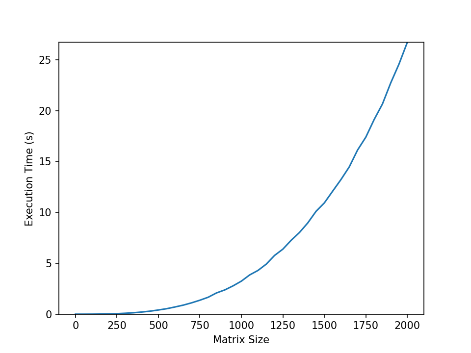
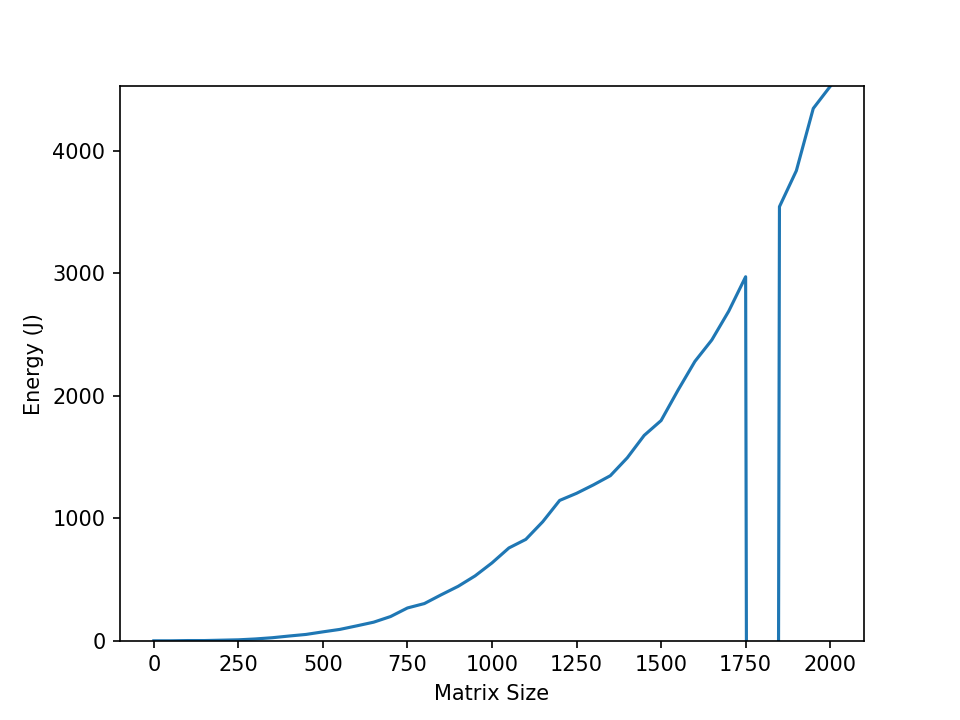
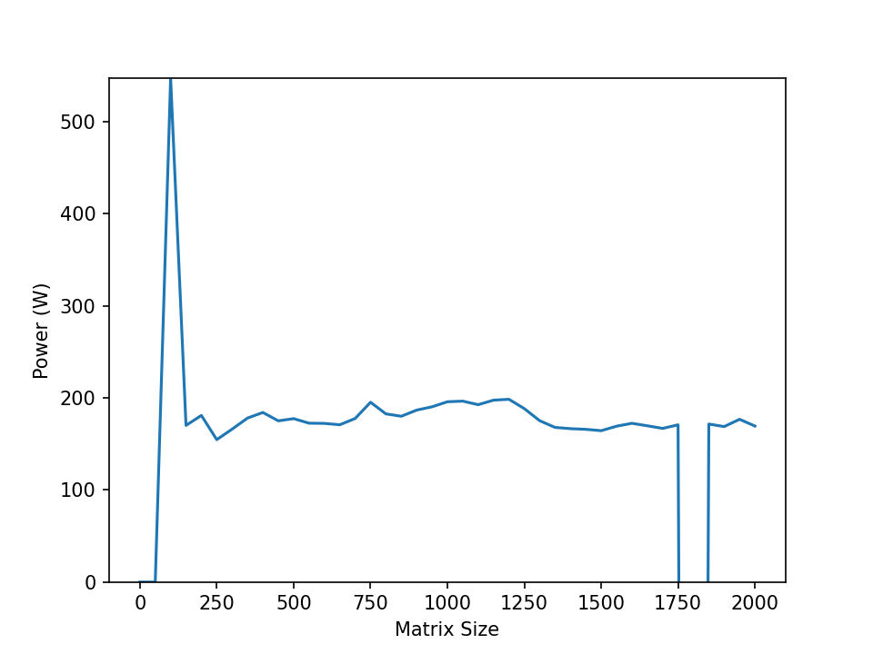

# Hands on Examples
1. Simple matrix multiplication 
2. Simple saxpy (single precision a*x + b)
3. **To Be Added Sparse matrix–vector multiplication (SpMV)**
4. **Simple Python implementation as well???**

## Simple Matrix multiplication
How to compile compile the program:
```
module purge
module load 2022
module load foss/2022a

g++ -fopenmp mat_mul.cpp -o mat_mul
```
Note: `-fopenmp` needed here because we use a simple OpenMP parallelization example.

How to run:
```
./mat_mul
```
Suggestion: Play around with the `OMP_NUM_THREADS` for your execution
```
OMP_NUM_THREADS=2 ./mat_mul
```
### PMT ([Power Measurement Toolkit](https://git.astron.nl/RD/pmt/)) is available as a module on Snellius
How to compile a c++ source code with PMT library: All you need to do is load the PMT module on Snellius and link to it ( `-lpmt`)  during compilation....
```
module purge
module load 2022
module load foss/2022a
module load pmt/1.1.0-foss-2022a

g++ -fopenmp -lpmt mat_mul_pmt.cpp -o mat_mul_pmt
```
Now run it and see what you observe.....
```
./mat_mul_pmt
```
# Energy Monitoring Excersize


<div class="image-single-row">
          </img>
          </img>
          </img>
</div>

### Run the "Energy study script"


```
sh energy_study.sh
```
This will output the results to the file `results.txt` 


You will need python as a plotting tool, which will read in `results.txt` and plot three pngs (`size_v_joule.png`,`size_v_time.png`, `size_v_watt.png`)

```
module load 2022
module load Python/3.10.4-GCCcore-11.3.0

pip install matplotlib --user
pip install numpy --user
```
